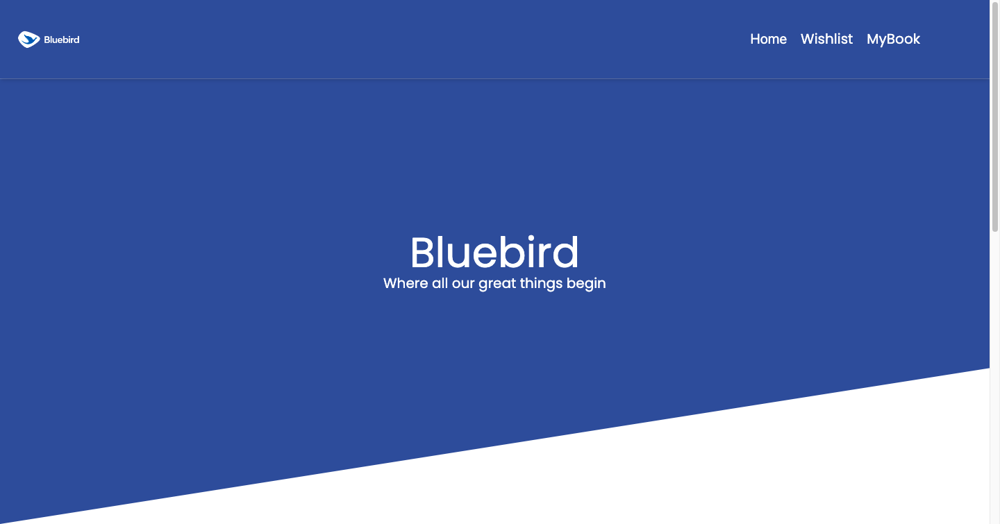

This is a [Next.js](https://nextjs.org/) project bootstrapped with [`create-next-app`](https://github.com/vercel/next.js/tree/canary/packages/create-next-app).

## Getting Started

First, run the development server:

```bash
npm run dev
# or
yarn dev
# or
pnpm dev
# or
bun dev
```

Open [http://localhost:3000](http://localhost:3000) with your browser to see the result.

Then a display like this will appear


Saya masih kebingungan bagaimana cara menambahkan list kedalam wishlist dan mybook, mungkin hanya sampai sini saja kemampuan saya, saya yakin saya akan cepat belajar hal baru.
